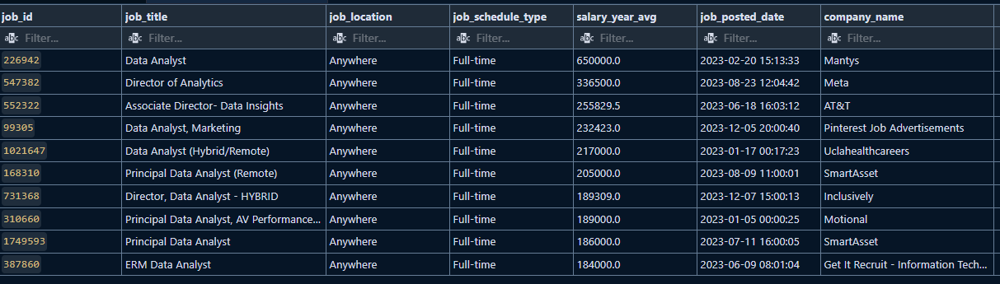

TODO: Update contents of this later

<!-- Introduction -->

# Introduction

Dive into the data job market! Focusing on data analyst roles, this project explores top-paying jobs, in demand skills, and where high demand meets high salary in data analytics.
SQL queries? Check them out here: [project_sql folder](/project_sql/)

<!-- Background -->

# Background

Motivated by a desire to better navigate the data analyst job market, this project was created to identify the highest-paying and most in-demand skills, helping others efficiently find the best job opportunities.

### The questions I wanted to answer through the SQL queries were:

1. What are the top-paying data analyst jobs?
2. What skills are required for these top-paying jobs?
3. What skills are most in demand for data analysts?
4. Which skills are associated with higher salaries?
5. What are the most optimal skills to learn?
<!-- Tools I Used -->

# Tools I Used

- **SQL:** Used to query the database and extract key insights.
- **MySQL:** A database management system well-suited for handling job posting data.
- **Visual Studio Code:** Used for managing the database and executing SQL queries.
- **Git & GitHub:** Tools for version control, sharing SQL scripts, and tracking project progress, enabling seamless collaboration.

<!-- The Analysis -->
<!-- # The Analysis
Each query for this project aimed at investigating specific aspects of the data analyst job market. Here’s how it was approached:
### 1. Top Paying Data Analyst Jobs
To identify the highest-paying roles, I filtered data analyst positions by average yearly salary and location, focusing on remote jobs. This query highlights the high paying opportunities in the field.

```sql
SELECT job_id,
    job_title,
    job_location,
    job_schedule_type,
    salary_year_avg,
    job_posted_date,
    name AS company_name
FROM job_postings_fact
    LEFT JOIN company_dim ON job_postings_fact.company_id = company_dim.company_id
WHERE job_title_short = 'Data Analyst'
    AND job_location = 'Anywhere'
    AND salary_year_avg != ''
ORDER BY CAST(salary_year_avg AS DECIMAL) DESC
LIMIT 10
```
Here's the breakdown of the top data analyst jobs in 2023:

- Wide Salary Range: Top 10 paying data analyst roles span from $184,000 to $650,000, indicating significant salary potential in the field.
- Diverse Employers: Companies like SmartAsset, Meta, and AT&T are among those offering high salaries, showing a broad interest across different industries.
- Job Title Variety: There's a high diversity in job titles, from Data Analyst to Director of Analytics, reflecting varied roles and specializations within data analytics.


### 2. Skills for Top Paying Jobs
To understand what skills are required for the top-paying jobs, I joined the job postings with the skills data, providing insights into what employers value for high paying roles.
```sql
    SELECT job_id,
        job_title,
        salary_year_avg,
        name AS company_name
    FROM job_postings_fact
        LEFT JOIN company_dim ON job_postings_fact.company_id = company_dim.company_id
    WHERE job_title_short = 'Data Analyst'
        AND job_location = 'Anywhere'
        AND salary_year_avg != ''
    ORDER BY CAST(salary_year_avg AS DECIMAL) DESC
    LIMIT 10
)
SELECT top_paying_jobs.*,
    skills
FROM top_paying_jobs
    INNER JOIN skills_job_dim ON top_paying_jobs.job_id = skills_job_dim.job_id
    INNER JOIN skills_dim ON skills_job_dim.skill_id = skills_dim.skill_id
ORDER BY salary_year_avg DESC
``` -->

<!-- What I learned -->

# What I Learnd

- Advanced SQL techniques, efficiently joining tables and using WITH clauses for temporary table operations.
- Proficient in using GROUP BY, along with aggregate functions like COUNT() and AVG(), to summarize data effectively
- Developed strong analytical skills, transforming complex questions into actionable and insightful SQL queries.
<!-- Conclusions -->

# Conclusions

This project enhanced my SQL skills and provided valuable insights into the data analyst job market. The findings from the analysis serve as a guide to prioritizing skill development and job search efforts. Aspiring data analysts can better position themselves in a competitive job market by focusing on high-demand, high-salary skills. This exploration highlights the importance of continuous learning and adaptation to emerging trends in the field of data analytics.
